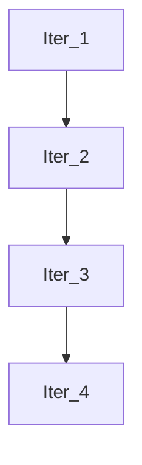

# SAGA 符號回歸調優 & UI 增強設計

**Date**: 2026-01-26  
**Author**: Brainstorming Session  
**Status**: Approved

## Objective

讓 SAGA 在使用本地 **Qwen 2.5 7B (Q4_K_M)** 模型時，能夠正確找到符號回歸問題的解。

**測試題目**：
- 數據點: `[(-3,-2),(-2,-4),(-1,-4),(0,-2),(1,2),(2,8),(3,16),(4,26)]`
- 正解: `y = x² + 3x - 2`

---

## 問題診斷

從用戶截圖觀察到：
1. 輸出 `x**2-x x) + x` → 語法錯誤，非合法公式
2. 分數 0.1504 → 極低，擬合效果差
3. 終止原因 `Score converged (eps=0.01)` → 過早收斂

**根本原因**：搜索策略過於保守，內部迭代次數不足，收斂判定過於寬鬆。

---

## Proposed Changes

### 1. 搜索策略優化（激進模式）

#### 1.1 後端參數 (`saga/runner.py`)

| 參數 | 原值 | 新值 | 位置 |
|------|------|------|------|
| `inner_iterations` | 6 | **15** | L155 |
| `batch_size` | 10 | **20** | L156 |

#### 1.2 前端預設模板 (`web_client/src/App.jsx`)

```javascript
symbolic_regression: {
  name: "符號回歸 (Symbolic Regression)",
  maxIters: 20,           // 原: 5
  convergenceEps: 0.001,  // 原: 0.01
  patience: 5,            // 原: 2
  weights: "0.85, 0.1, 0.05",  // 原: 0.5, 0.3, 0.2 (純粹追求擬合)
}
```

#### 1.3 LLM 取樣參數 (`.env`)

| 參數 | 原值 | 新值 | 理由 |
|------|------|------|------|
| `SGLANG_TEMPERATURE` | 0.6 | **0.4** | 更穩定的數學表達式 |
| `SGLANG_TOP_K` | 20 | **10** | 減少隨機性 |

---

### 2. UI 可視化增強

#### 2.1 新增 LLM 事件類型

在 `saga/search/generators.py` 的 `LLMGenerator.generate()` 中發送事件：

```python
# Request 事件
{
  "type": "llm_request",
  "prompt_preview": "...(前200字)...",
  "iteration": 3,
  "timestamp": 1706234567.89
}

# Response 事件
{
  "type": "llm_response",
  "raw_preview": "...(前300字)...",
  "parsed_candidates": ["x**2 + 3*x - 2", ...],
  "filtered_count": 2,
  "accepted_count": 5
}
```

#### 2.2 事件除錯格式化

將「事件除錯」面板的 JSON 改為可展開的樹狀結構：

- 使用 `react-json-view` 或類似組件
- 每個事件可點擊展開
- 根據 `type` 顯示不同顏色圖標

#### 2.3 顏色區分

| 事件類型 | 顏色 | 圖標 |
|----------|------|------|
| `system_log` | 灰色 | 📝 |
| `llm_request` | 藍色 | 🔵 |
| `llm_response` | 綠色 | 🟢 |
| `error` | 紅色 | 🔴 |
| `iteration_update` | 黃色 | 🔄 |

---

### 3. 運算圖功能實現

#### 3.1 產生時機

在 `saga/outer_loop.py` 的 `run()` 結束時呼叫：

```python
from saga.trace.graph import write_graph, write_mermaid

# 在 yield FinalReport 之前
nodes = [{"id": f"Iter_{i}", "label": f"Iteration {i}", "score": s} 
         for i, s in enumerate(state.score_history, 1)]
edges = [{"from": f"Iter_{i}", "to": f"Iter_{i+1}"} 
         for i in range(1, len(nodes))]

run_dir = self.config.run_path(run_id)
write_graph(run_dir / "graph.json", nodes, edges)
write_mermaid(run_dir / "workflow.mmd", edges)
```

#### 3.2 Mermaid 輸出範例



---

## Verification Plan

### 自動測試
```bash
# 重建服務
docker compose up -d --build saga_server web

# 手動測試符號回歸
# 在 UI 上選擇「符號回歸」模板，執行後觀察：
# 1. 是否能找到接近 x**2 + 3*x - 2 的公式
# 2. 分數是否接近 1.0
# 3. LLM 日誌是否正常顯示
# 4. 運算圖是否正常渲染
```

### 成功標準
- [ ] 公式 `x**2 + 3*x - 2` 或等價形式出現在候選中
- [ ] 最終分數 ≥ 0.95
- [ ] UI 顯示 LLM 輸入/輸出日誌
- [ ] 運算圖正確顯示迭代流程

---

## Files to Modify

| 檔案 | 修改內容 |
|------|----------|
| `saga/runner.py` | 調整 `inner_iterations`, `batch_size` |
| `saga/outer_loop.py` | 添加 `write_graph` / `write_mermaid` 呼叫 |
| `saga/search/generators.py` | 添加 LLM 事件發送（需 WebSocket callback） |
| `web_client/src/App.jsx` | 更新模板預設值、事件格式化 UI |
| `.env` | 調整 `SGLANG_TEMPERATURE`, `SGLANG_TOP_K` |
